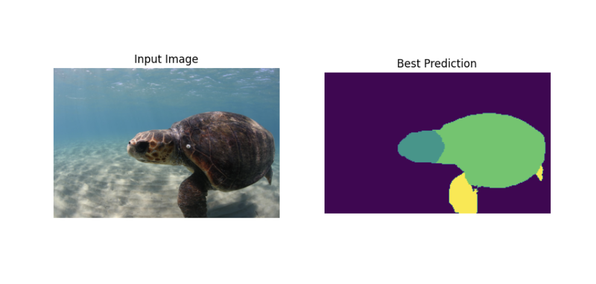

# U-NET METHOD

## Overview
## Model

U-Net is distinguished by its architecture that efficiently utilizes both local and context information to perform precise and detailed image segmentation, which is especially valuable in medical imaging and other applications where precise localization of structures is crucial. The use of skip connections and the ability to train on limited data with extensive data augmentation are also notable features that set U-Net apart from other segmentation methods.

## Training
The model is trained for 50 epochs.
Loss function for the training is CrossEntropyLoss.

## How to use
***
### Dependencies
Python 3

PyTorch

numpy pandas matplotlib torch torchvision torchaudio

If your PC is based on Apple Silicon ------ self.device = torch.device('mps' if torch.backends.mps.is_available() else 'cpu')
If your PC is based on Intel Silicon ------ self.device = torch.device('cuda' if torch.cuda.is_available() else 'cpu') 

## Data
The original dataset is SeaTurtleID2022 Dataset and the annotations.json file have annotations in the Common Objects in Context (COCO) format.
### step1
Pass 'annotations.json', image storage path, GT storage path into COCO, root, GT_path, **run gt_creater.py**, and store the GT diagram generated according to annotation.js in the path correctly
### step2
Set the downloaded SeaTurtleID2022 Dataset and GT graph path to 'origin_data_path' and 'origin_GT_path' in dataset.py, **Run dataset.py** to generate a dataset from the original images folder that can be used by the model
### step3
Run main.py

## Result

[test] JS_flipper: 0.4264, JS_carapace: 0.5263, JS_head: 0.4041, JS: 0.4523